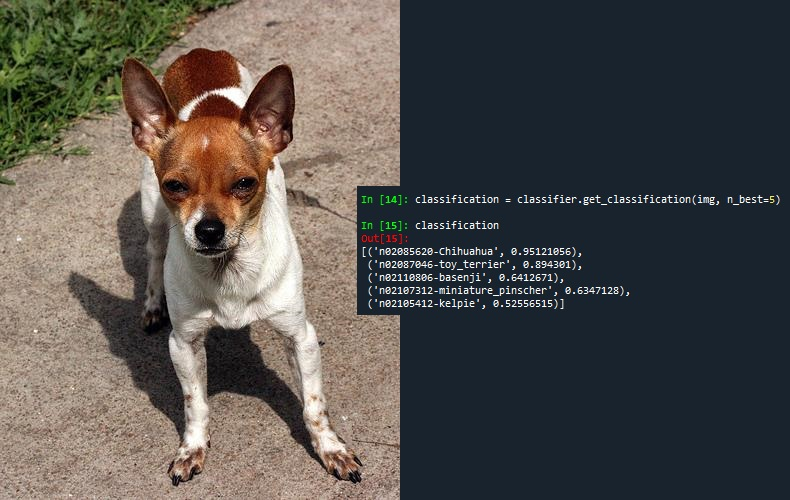

# dog-breed-recognition
An algorithm for the recognition of dog breeds from RGB images.

## App usage
- Clone the repository:
````
git clone https://github.com/rrbarioni/dog-breed-recognition.git
````
- Generate the dog embeddings extractor as described at **Dog Embeddings Extraction and Breed Enrolling**;
- Generate the Docker image:
````
docker build -t dog_breed_recognition_image .
````
- Run the Docker image with a batch size of your desire (according to your computational power):
````
docker run -e batch_size=8 -p 80:80 dog_breed_recognition_image
````
The system should be live at `http://0.0.0.0:80/`

**Note**: If using a GPU, please refer to `requirements.txt` for changing the *torch* and *torchvision* dependencies by removing "+cpu".

## Dog Breed Classification
This is a **ResNet50-based Convolutional Neural Network (CNN)** to classify dogs among 100 breeds. Given an image of a dog, the algorithm is responsible for predicting its breed.

### Instructions

#### Getting the pre-trained classifier

- Download the classifier [here](https://drive.google.com/file/d/1-8vHTVxI5SxEuK41xujYHUHjqZtyJhaC/view?usp=sharing);
- After cloning the repository locally (let's call it *root/*), create a directory called *models/* inside of it (so it should be *root/models/*) and place the downloaded classifier *classifier.pth* there.

#### (Or train the classifier on your own)

It is important to mention that, as I do not have a machine with GPU, I have used Google Colab for this purpose. As so, here is what I did:
 
- Created a directory in Google Drive (let's call it *dog-breed-recognition/*);
- Created a directory inside *dog-breed-recognition/* called *src/* (so it should be *dog-breed-recognition/src/*), in order to place the training code there;
- Inside *dog-breed-recognition/src/*, I have placed my training classifier notebook code (*src/classifier.ipynb*) there;
- Created a directory inside *dog-breed-recognition/* called *models/* (so it should be *dog-breed-recognition/models/*), in order to place the trained model there;
- Downloaded the dog breed dataset [here](https://drive.google.com/file/d/1DAyRYzZ9B-Nz5hLL9XIm3S3kDI5FBJH0/view);
- Unzipped the dataset (now locally having a directory called *dogs/*);
- Uploaded the dataset *dogs/train* into Google Drive (at directory *dog-breed-recognition/dogs/train*).
- Now, *dog-breed-recognition/* at Google Drive should be like this:
````
|-- dog-breed-recognition/
    |-- dogs/
        |-- train/
            |-- n02085620-Chihuahua/
            |-- n02085782-Japanese_spaniel/
                        ⋮
            |-- n02115913-dhole/
    |-- src/
        |-- classifier.ipynb
    |-- models/
````
- Follow the instructions at *dog-breed-recognition/src/classifier.ipynb* to generate the classifier, which will be stored at *dog-breed-recognition/models/classifier.pth*;
- After cloning the repository locally (let's call it *root/*), create a directory called *models/* inside of it (so it should be *root/models/*) and place the generated classifier from Google Colab (*dog-breed-recognition/models/classifier.pth*) there.

#### Using the classifier

For usage on a input image, you may refer to *root/src/classification.py*; from an image of a dog, the classifier outputs a list of n-mostlike dog breeds, as well as their confidence values.



## Dog Embeddings Extraction and Breed Enrolling
This is a two-step algorithm for extract embeddings from images and dynamically add new unknown dog breeds for recognition. Given an image of a dog, the algorithm is responsible for extracting embeddings by using a **ResNet50-based Convolutional Neural Network (CNN)**. Also, a *K-Nearest Neighbors (KNN)* classifier is applied to separate different dog breeds by their embeddings.

### Instructions

#### Getting the pre-trained embeddings extractor

- Download the pre-trained embeddings extractor [here](https://drive.google.com/file/d/1zhXNrfpoA_JYlcU2QgCVW8VKfFZMTN62/view?usp=sharing);
- After cloning the repository locally (let's call it *root/*), create a directory called *models/* inside of it (so it should be *root/models/*) and place the downloaded embeddings extractor *embedder.pth* there.

#### (Or train the embeddings extractor on your own)

It is important to mention that, as I do not have a machine with GPU, I have used Google Colab for this purpose. As so, here is what I did:
 
- Created a directory in Google Drive (let's call it *dog-breed-recognition/*);
- Created a directory inside *dog-breed-recognition/* called *src/* (so it should be *dog-breed-recognition/src/*), in order to place the training code there;
- Inside *dog-breed-recognition/src/*, I have placed my training embedding extractor notebook code (*src/embedder.ipynb*) there;
- Created a directory inside *dog-breed-recognition/* called *models/* (so it should be *dog-breed-recognition/models/*), in order to place the trained model there;
- Downloaded the dog breed dataset [here](https://drive.google.com/file/d/1DAyRYzZ9B-Nz5hLL9XIm3S3kDI5FBJH0/view);
- Unzipped the dataset (now locally having a directory called *dogs/*);
- Uploaded the dataset *dogs/train* into Google Drive (at directory *dog-breed-recognition/dogs/train*).
- Now, *dog-breed-recognition/* at Google Drive should be like this:
````
|-- dog-breed-recognition/
    |-- dogs/
        |-- train/
            |-- n02085620-Chihuahua/
            |-- n02085782-Japanese_spaniel/
                        ⋮
            |-- n02115913-dhole/
    |-- src/
        |-- embedder.ipynb
    |-- models/
````
- Follow the instructions at *dog-breed-recognition/src/embedder.ipynb* to generate the embeddings extractor, which will be stored at *dog-breed-recognition/models/embedder.pth*;
- After cloning the repository locally (let's call it *root/*), create a directory called *models/* inside of it (so it should be *root/models/*) and place the generated embedder from Google Colab (*dog-breed-recognition/models/embedder.pth*) there.

#### Getting the pre-generated embeddings from a initial set of dog breeds

- Download pre-generated embeddings [here](https://drive.google.com/file/d/1atfoq6365gZfT4F3uauHShx4G14o3LHF/view?usp=sharing);
- After cloning the repository locally (let's call it *root/*), create a directory called *models/* inside of it (so it should be *root/models/*) and place the downloaded training set of embeddings *initial_enroll.pkl* there.

#### (Or generate embeddings from a initial set of dog breeds on your own)

This step is also performed at Google Colab, once it aims to extract embeddings of dog images of all dog breed from the training set. Here is what I did:

- Similarly to the embeddings extractor training, I have placed my initial embeddings extraction notebook code (*src/initial_enroller.ipynb*) in Google Drive, at *dog-breed-recognition/src/*;
- Now, *dog-breed-recognition/* at Google Drive should be like this:
````
|-- dog-breed-recognition/
    |-- dogs/
        |-- train/
            |-- n02085620-Chihuahua/
            |-- n02085782-Japanese_spaniel/
                        ⋮
            |-- n02115913-dhole/
    |-- src/
        |-- embedder.ipynb
        |-- initial_enroller.ipynb
    |-- models/
````
- Follow the instructions at *dog-breed-recognition/src/initial_enroller.ipynb* to generate embeddings from the training set, which will be stored at *dog-breed-recognition/models/initial_enroll.pkl*;
- After cloning the repository locally (let's call it *root/*), create a directory called *models/* inside of it (so it should be *root/models/*) and place the generated training set embeddings from Google Colab (*dog-breed-recognition/models/initial_enroll.pkl*) there.

#### Using the dog breed enroller

For usage on an input new dog breed, you may refer to *root/src/enroll.py*; from a directory containing images from the same dog breed, the enroller dynamically adds this dog breed to a classifier, in order to be recognized when inputting new dog image samples of that dog breed.

#### Evaluating the dog breed enroller

For testing the quality of the dog breed enroller, do the following:

- Download the pre-generated embeddings of the training set [here](https://drive.google.com/file/d/1atfoq6365gZfT4F3uauHShx4G14o3LHF/view?usp=sharing);
- Download the pre-generated embeddings of the enroll test set [here](https://drive.google.com/file/d/1PN6h9YzYITR5jtD3Ydb4YlG0q8c_gOD-/view?usp=sharing);
- Download the pre-generated embeddings of the test set to be evaluated [here](https://drive.google.com/file/d/1-1LLZdRdVHNWBpBfbSx5vNaGH3Yo3Ans/view?usp=sharing);
- After cloning the repository locally (let's call it *root/*), create a directory called *models/* inside of it (so it should be *root/models/*). Then, place the three downloaded embeddings files (*initial_enroll.pkl*, *new_enroll.pkl* and *new_enroll_test.pkl*) there;
- Navigate to the *root/src/* folder and execute the following command:
````
python test_enroller.py
````
Then, you should analyze accuracy of the embeddings-based dog breed classificator, considering seen and unseen dog breeds.
